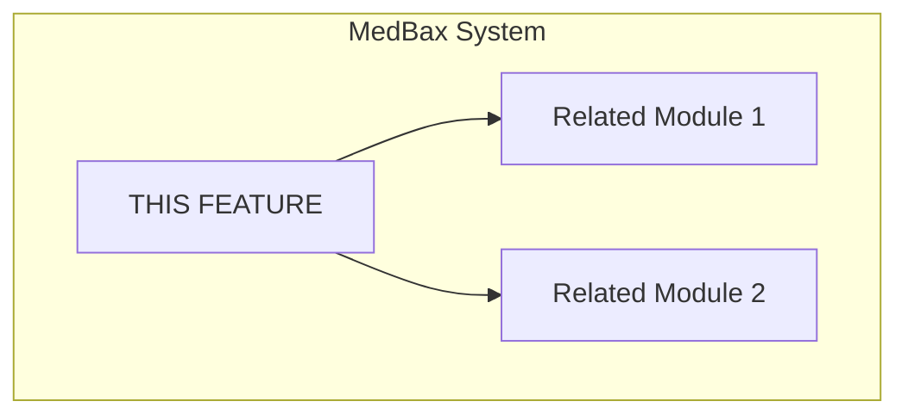
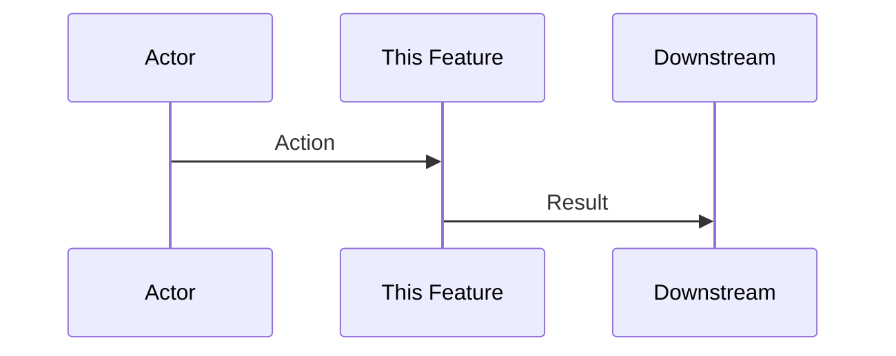

# [Feature Name] Implementation v1

> One-line summary of the feature.

---

## Version History

| Version | Date | Summary |
|---------|------|---------|
| v1 | YYYY-MM-DD | Initial implementation |

---

## Architecture Context

### System Position



### Communication Points

| Communicates With | Direction | Purpose |
|-------------------|-----------|---------|
| Module A | → (outgoing) | What data/actions |
| Module B | ← (incoming) | What data/actions |

### Dependencies

- **Upstream:** What this feature depends on
- **Downstream:** What depends on this feature

---

## Implementation Details

### Key Files

| File | Purpose |
|------|---------|
| `src/path/file.tsx` | Description |
| `convex/file.ts` | Description |

### Core Logic

```typescript
// Key code patterns or examples
```

### Data Flow



---

## API Surface

### Functions/Hooks

| Name | Parameters | Returns | Description |
|------|------------|---------|-------------|
| `functionName` | `(param: Type)` | `ReturnType` | What it does |

### Convex Operations

| Operation | Type | Description |
|-----------|------|-------------|
| `api.module.query` | Query | What it fetches |
| `api.module.mutation` | Mutation | What it modifies |

---

## Configuration

| Setting | Default | Description |
|---------|---------|-------------|
| `CONFIG_VAR` | `value` | What it controls |

---

## Testing

### Manual Verification
1. Step 1
2. Step 2
3. Expected result

### Commands
```bash
npm run test:feature
```

---

## Known Issues & TODOs

- [ ] Pending improvement 1
- [ ] Pending improvement 2
