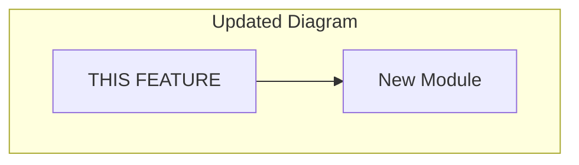

# [Feature Name] Implementation v{N}

> One-line summary of what changed in this version.

---

## Version History

| Version | Date | Summary |
|---------|------|---------|
| v{N} | YYYY-MM-DD | This version's changes |
| v{N-1} | YYYY-MM-DD | Previous version summary |
| v1 | YYYY-MM-DD | Initial implementation |

---

## What Changed (v{N-1} → v{N})

### Breaking Changes

> [!CAUTION]
> List any breaking changes that require updates elsewhere.

- Change 1: Description
- Change 2: Description

### New Features

- Feature 1: Description
- Feature 2: Description

### Bug Fixes

- Fix 1: Description

### Refactoring

- Refactor 1: Description

---

## Migration Guide

Steps to migrate from v{N-1}:

1. Update X
2. Modify Y
3. Test Z

---

## Updated Architecture

### Changes to System Position



### New/Modified Communication Points

| Communicates With | Direction | Change |
|-------------------|-----------|--------|
| New Module | → | Added in this version |
| Old Module | ✕ | Removed |

---

## Implementation Changes

### Modified Files

| File | Change Type | Description |
|------|-------------|-------------|
| `path/file.tsx` | Modified | What changed |
| `path/new.tsx` | Added | Why added |
| `path/old.tsx` | Deleted | Why removed |

### Key Code Changes

```diff
- oldCode()
+ newCode()
```

---

## New API Surface

### Added Functions

| Name | Parameters | Returns | Description |
|------|------------|---------|-------------|
| `newFunction` | `(param: Type)` | `ReturnType` | What it does |

### Deprecated

| Name | Replacement | Removal Version |
|------|-------------|-----------------|
| `oldFunction` | `newFunction` | v{N+1} |

---

## Testing Updates

### New Test Cases
- Test case 1
- Test case 2

### Regression Verification
1. Verify old behavior still works
2. Verify new behavior works

---

## Known Issues & TODOs

- [ ] Pending from this version
- [x] Resolved from v{N-1}
