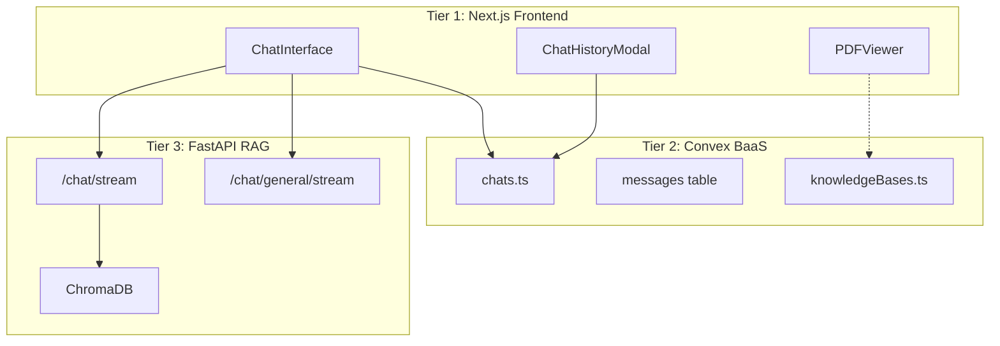
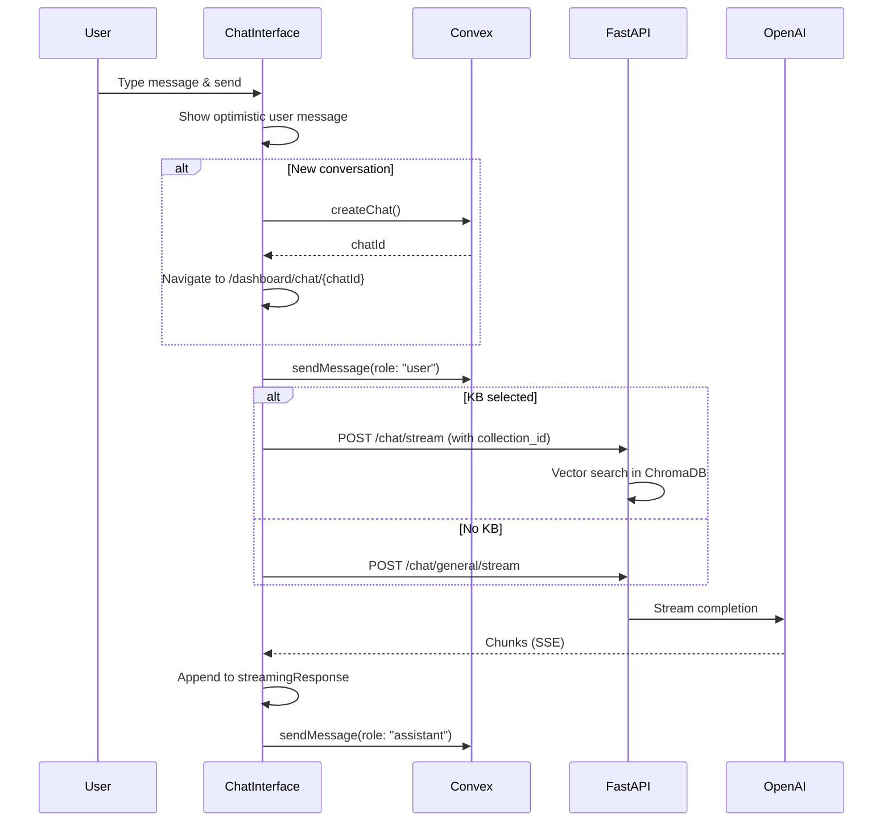

# Chat Feature Implementation v1

> AI-powered medical chat interface with RAG knowledge base integration and PDF citation viewer.

---

## Version History

| Version | Date | Summary |
|---------|------|---------|
| v1 | 2025-12-27 | Initial implementation - streaming chat, KB selector, PDF viewer |
| v2 | 2025-12-27 | Unified ID system - Sources metadata, indexed lookup |
| v3 | 2026-01-14 | Subscription limits, health panel, KB persistence |

---

## Architecture Context

### System Position



### Communication Points

| Communicates With | Direction | Purpose |
|-------------------|-----------|---------|
| `convex/chats.ts` | ↔ bidirectional | Create chats, send/get messages |
| `convex/knowledgeBases.ts` | ← incoming | Fetch KB list, get document URLs for PDF viewer |
| FastAPI `/chat/stream` | → outgoing | RAG queries with KB context |
| FastAPI `/chat/general/stream` | → outgoing | General AI chat (no KB) |

### Dependencies

- **Upstream:**
  - Clerk authentication (user must be logged in)
  - Patient profile (patientId required for chat ownership)
  - Knowledge bases (optional, for RAG queries)
  
- **Downstream:**
  - PDF Viewer (receives document URLs from citation clicks)
  - Chat history (persisted to Convex for future sessions)

---

## Implementation Details

### Key Files

| File | Lines | Purpose |
|------|-------|---------|
| [`src/components/chat/ChatInterface.tsx`](file:///c:/personalData/devProjects/medbax/src/components/chat/ChatInterface.tsx) | 624 | Main chat UI with streaming, KB selector, citation handling |
| [`src/components/chat/ChatHistoryModal.tsx`](file:///c:/personalData/devProjects/medbax/src/components/chat/ChatHistoryModal.tsx) | 112 | Modal to list/navigate past conversations |
| [`src/components/chat/PDFViewer.tsx`](file:///c:/personalData/devProjects/medbax/src/components/chat/PDFViewer.tsx) | 174 | react-pdf based viewer with zoom/pagination |
| [`src/lib/rag-api.ts`](file:///c:/personalData/devProjects/medbax/src/lib/rag-api.ts) | 304 | FastAPI client for RAG operations |
| [`convex/chats.ts`](file:///c:/personalData/devProjects/medbax/convex/chats.ts) | 105 | Convex mutations/queries for chat CRUD |

### Core Data Flow



### Component State

**ChatInterface.tsx** manages significant state:

```typescript
// Core
const [input, setInput] = useState("");
const [sending, setSending] = useState(false);

// Streaming
const [streamingResponse, setStreamingResponse] = useState("");
const [isWaitingForResponse, setIsWaitingForResponse] = useState(false);

// Optimistic UI
const [optimisticUserMessage, setOptimisticUserMessage] = useState<string | null>(null);

// Knowledge Base
const [selectedKB, setSelectedKB] = useState<string | null>(null);
const [isKBDropdownOpen, setIsKBDropdownOpen] = useState(false);

// PDF Viewer
const [viewingDocument, setViewingDocument] = useState<{ filename: string; page: number } | null>(null);
```

### Citation Handling

Citations are embedded in AI responses as `[Source: filename.pdf, Page: X]` and converted to clickable links:

```typescript
// preprocessContent() converts citations to markdown links
const preprocessContent = (content: string) => {
    return content.replace(
        /\[Source: (.*?), Page: (\d+)\]/g,
        (match, filename, page) => {
            return `**[${match}](citation:${encodeURIComponent(filename)}?page=${page})**`;
        }
    );
};
```

When clicked, `setViewingDocument({ filename, page })` opens the PDF panel.

### PDF Resolution Strategy

The viewer determines document source based on whether citation has a `documentId`:

```typescript
const isPatientDoc = !!viewingSource?.documentId;

// Strategy A: Patient document (from 'documents' table)
const patientDoc = useQuery(api.documents.getDocument, 
    isPatientDoc ? { id: viewingSource.documentId } : "skip"
);

// Strategy B: KB document (search by filename)
const kbDocUrl = useQuery(api.knowledgeBases.getDocumentUrlByFilename,
    !isPatientDoc ? { filename: viewingDocument.filename } : "skip"
);

const resolvedUrl = isPatientDoc ? patientDoc?.fileUrl : kbDocUrl;
```

---

## API Surface

### Frontend Components

| Component | Props | Description |
|-----------|-------|-------------|
| `ChatInterface` | `chatId?: string, patientId: string` | Main chat UI |
| `ChatHistoryModal` | `isOpen, onClose, patientId` | History list modal |
| `PDFViewer` | `url, fileName, isLoading, onClose, initialPage` | PDF viewer panel |

### RAG API Client (`rag-api.ts`)

| Function | Parameters | Returns | Description |
|----------|------------|---------|-------------|
| `queryKnowledgeBaseStream` | `collectionId, query, onChunk, onError?, onComplete?, history?` | `void` | RAG query with streaming |
| `generalChatStream` | `query, onChunk, onError?, onComplete?, history?` | `void` | General AI chat |

### Convex Operations

| Operation | Type | Description |
|-----------|------|-------------|
| `api.chats.createChat` | Mutation | Create new conversation |
| `api.chats.listChats` | Query | List patient's chats |
| `api.chats.getMessages` | Query | Get messages for a chat |
| `api.chats.sendMessage` | Mutation | Add message to chat |
| `api.chats.deleteChat` | Mutation | Delete chat + messages |
| `api.knowledgeBases.listPublic` | Query | Get available KBs for selector |
| `api.knowledgeBases.getDocumentUrlByFilename` | Query | Resolve PDF URL for viewer |

---

## UI Components

### Welcome Screen (No active chat)

- Greeting with user's first name
- 4 prompt suggestion cards (grid layout)
- "Refresh Prompts" and "View All Chats" links

### Message List

- User messages: Right-aligned, indigo background
- Assistant messages: Left-aligned, white/dark card with "MedBax AI" label
- Typing indicator: 3 bouncing dots
- Citations: Styled as clickable chips with external link icon

### Input Area

- Auto-resizing textarea
- KB selector dropdown (top-right)
- Action buttons: Plus, Image upload (placeholder)
- Character counter (0/1000)
- Send button with loading state

### PDF Viewer Panel

- Split view (50/50 when active)
- Header: Filename, page counter, zoom controls, close button
- Body: react-pdf Document/Page rendering
- Floating pagination controls (shown on hover)

---

## Known Issues & TODOs

- [ ] **Image upload** - Button exists but functionality not implemented
- [ ] **Prompt suggestions** - Click handlers not wired (suggestions don't populate input)
- [ ] **Refresh prompts** - Static, no dynamic prompt generation
- [ ] **Character limit** - Shows 0/1000 but doesn't enforce max
- [ ] **PDF viewer responsiveness** - Fixed 50% width doesn't adapt to mobile
- [ ] **Citation fallback** - No graceful handling if PDF URL can't be resolved
- [ ] **Conversation history limit** - Sends all messages to AI (no truncation for long chats)
- [ ] **Error states** - Limited error UI for failed messages
- [ ] **KB persistence** - Selected KB resets on page refresh

---

## Configuration

| Setting | Source | Default | Description |
|---------|--------|---------|-------------|
| `NEXT_PUBLIC_RAG_API_URL` | `.env.local` | `http://localhost:8000` | FastAPI backend URL |

---

## Related Documentation

- **v2 (Sources/Metadata):** [`chat_implementation_v2.md`](file:///c:/personalData/devProjects/medbax/implementation/chat/chat_implementation_v2.md)
- **v3 (Latest):** [`chat_implementation_v3.md`](file:///c:/personalData/devProjects/medbax/implementation/chat/chat_implementation_v3.md)
- **Architecture:** [THREE_TIER_ARCHITECTURE.md](file:///c:/personalData/devProjects/medbax/docs/THREE_TIER_ARCHITECTURE.md)
- **Knowledge Bases:** [knowledge_bases_implementation_v1.md](file:///c:/personalData/devProjects/medbax/implementation/knowledge-bases/knowledge_bases_implementation_v1.md)
- **Schema:** [convex/schema.ts](file:///c:/personalData/devProjects/medbax/convex/schema.ts)
