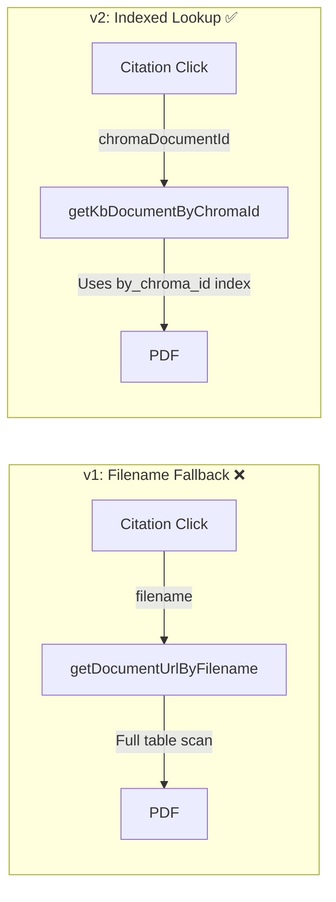

# Chat Feature Implementation v2

> AI-powered medical chat with **structured source metadata** and indexed document resolution.

---

## Version History

| Version | Date | Summary |
|---------|------|---------|
| v1 | 2025-12-27 | Initial - streaming chat, KB selector, PDF viewer |
| **v2** | **2025-12-27** | **Unified ID system - discriminated sources, FastAPI metadata, indexed lookup** |

---

## Changelog from v1

### Phase 1: Discriminated Source Types

**Problem:** `messages.sources` only had optional `documentId` for patient docs. KB documents used fragile filename-based global search.

**Solution:** Added `sourceType` discriminator with separate ID fields:

```diff
 sources: v.array(v.object({
     title: v.string(),
     snippet: v.string(),
-    documentId: v.optional(v.id("documents")),
+    sourceType: v.union("kb_document", "patient_document", "chat_attachment"),
+    kbDocumentId: v.optional(v.id("knowledgeBaseDocuments")),
+    patientDocumentId: v.optional(v.id("documents")),
+    pageNumber: v.optional(v.number()),
+    chromaDocumentId: v.optional(v.string()),
 }))
```

### Phase 2: FastAPI Source Metadata

**Problem:** AI responses contained only text citations `[Source: file.pdf, Page: X]`. No structured metadata was returned.

**Solution:** FastAPI now appends structured sources as JSON after the AI response:

```
[AI response text...]

<<<SOURCES_JSON>>>
[{"title":"file.pdf","snippet":"...","sourceType":"kb_document","chromaDocumentId":"doc_abc123","pageNumber":1}]
```

**Files changed:**
- `fast/retriever.py` - `retrieve_context()` returns `(context, sources)` tuple
- `fast/rag_pipeline.py` - `answer_question()` returns `(response, sources)` tuple  
- `fast/main.py` - `/chat/stream` appends delimiter + JSON after streaming
- `src/lib/rag-api.ts` - Parses delimiter, calls `onComplete(sources)`

### Phase 3: Indexed Document Lookup

**Problem:** `chromaDocumentId` from FastAPI didn't map to Convex `kbDocumentId`.

**Solution:** Use existing `by_chroma_id` index for direct lookup:

```typescript
// New query in knowledgeBases.ts
export const getKbDocumentByChromaId = query({
    args: { chromaDocumentId: v.string() },
    handler: async (ctx, args) => {
        const doc = await ctx.db
            .query("knowledgeBaseDocuments")
            .withIndex("by_chroma_id", (q) => q.eq("chromaDocumentId", args.chromaDocumentId))
            .first();
        ...
    },
});
```

---

## Updated Architecture

### Document Resolution Flow



### Source Resolution Strategy (v2)

```typescript
// 1. Patient documents - by patientDocumentId
const patientDoc = useQuery(api.documents.getDocument,
    sourceType === "patient_document" ? { id: viewingSource.patientDocumentId } : "skip"
);

// 2. KB documents - by chromaDocumentId (PREFERRED)
const kbDocByChroma = useQuery(api.knowledgeBases.getKbDocumentByChromaId,
    sourceType === "kb_document" && viewingSource?.chromaDocumentId
        ? { chromaDocumentId: viewingSource.chromaDocumentId } : "skip"
);

// 3. Fallback - filename (legacy citations)
const kbDocUrlFallback = useQuery(api.knowledgeBases.getDocumentUrlByFilename,
    sourceType === "kb_document" && !viewingSource?.chromaDocumentId
        ? { filename: viewingDocument.filename } : "skip"
);

const resolvedUrl = patientDoc?.fileUrl || kbDocByChroma?.url || kbDocUrlFallback;
```

---

## Files Modified in v2

| File | Change |
|------|--------|
| `convex/schema.ts` | Added `sourceType`, `chromaDocumentId`, `pageNumber` to sources |
| `convex/chats.ts` | Updated `sendMessage` mutation args |
| `convex/knowledgeBases.ts` | Added `getKbDocumentByChromaId` query |
| `fast/retriever.py` | Returns `(context, sources)` tuple |
| `fast/rag_pipeline.py` | Returns `(response, sources)` tuple |
| `fast/main.py` | Appends `<<<SOURCES_JSON>>>` + JSON to stream |
| `src/lib/rag-api.ts` | Added `RagSource` interface, parses delimiter |
| `src/components/chat/ChatInterface.tsx` | Uses `chromaDocumentId` for resolution |
| `src/components/chat/CitationPreview.tsx` | Shows source type badge |

---

## Known Issues (Updated)

| Issue | Status |
|-------|--------|
| Image upload | ⬜ Not implemented |
| Prompt suggestions | ⬜ Not wired |
| Character limit | ⬜ Not enforced |
| PDF viewer mobile | ⬜ Not responsive |
| **Citation fallback** | ✅ **Fixed** - Uses indexed lookup |
| KB persistence | ⬜ Resets on refresh |
| Chat attachments | ⬜ Schema ready, UI not implemented |

---

## Related Documentation

- **v1 Implementation:** [`chat_implementation_v1.md`](file:///c:/personalData/devProjects/saas-medical/implementation/chat/chat_implementation_v1.md)
- **Architecture:** [`THREE_TIER_ARCHITECTURE.md`](file:///c:/personalData/devProjects/saas-medical/docs/THREE_TIER_ARCHITECTURE.md)
