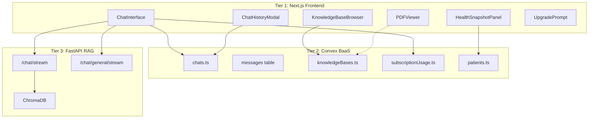

# Chat Feature Implementation v3

> AI-powered medical chat with **subscription limits**, **health context panel**, and **persisted KB selection**.

---

## Version History

| Version | Date | Summary |
|---------|------|---------|
| v1 | 2025-12-27 | Initial - streaming chat, KB selector, PDF viewer |
| v2 | 2025-12-27 | Unified ID system - discriminated sources, FastAPI metadata, indexed lookup |
| **v3** | **2026-01-14** | **Subscription limits, health panel, KB persistence, prompt suggestions, conversation history** |

---

## Changelog from v2

### 1. Subscription & Usage Limits

**Problem:** Users could make unlimited AI queries regardless of plan.

**Solution:** Integrated subscription tier enforcement with usage tracking and upgrade prompts.

**New Hook:** `useSubscription`
```typescript
const { tier, queryLimit } = useSubscription();
const usage = useQuery(api.subscriptionUsage.getCurrentUsage);
const queryCount = usage?.queryCount ?? 0;
const isAtLimit = queryCount >= queryLimit;
```

**Features:**
- Query limit check before sending messages
- Usage badge showing `{queryCount}/{queryLimit}` with color coding (green → amber → red)
- `UpgradePrompt` component when at limit
- Disabled input when limit reached

**Files changed:**
- `src/components/chat/ChatInterface.tsx` - Usage display, limit checks
- `src/hooks/useSubscription.ts` - New hook for tier/limits
- `src/components/subscription/UpgradePrompt.tsx` - Upgrade CTA
- `convex/chats.ts` - Usage increment in `sendMessage`

---

### 2. Health Snapshot Panel

**Problem:** Users couldn't see patient health context while chatting.

**Solution:** Collapsible right-side panel showing patient health data.

```typescript
const [healthPanelOpen, setHealthPanelOpen] = useState(false);
const patient = useQuery(api.patients.get, { id: patientId as Id<"patients"> });
```

**New Component:** `HealthSnapshotPanel`
- Displays patient vitals, conditions, medications, allergies
- Toggle button in chat header with User icon
- Slides in from right side

---

### 3. KB Persistence Fix

**Problem (v1):** Selected KB reset on page refresh.

**Solution:** KB selection now persisted to chat record via `updateChatKB` mutation.

```typescript
const updateChatKB = useMutation(api.chats.updateChatKB);

// On KB selection
onSelectKB={(kbId) => {
    setSelectedKB(kbId);
    if (chatId) {
        updateChatKB({
            chatId: chatId as Id<"chats">,
            knowledgeBaseId: kbId ?? undefined
        });
    }
}}

// On chat load - restore from persisted value
useEffect(() => {
    if (currentChat?.knowledgeBaseId !== undefined) {
        setSelectedKB(currentChat.knowledgeBaseId ?? null);
    }
}, [currentChat?.knowledgeBaseId]);
```

**New Mutation:** `updateChatKB` in `convex/chats.ts`

---

### 4. Prompt Suggestions Working

**Problem (v1):** Prompt suggestion cards didn't trigger messages.

**Solution:** Cards now call `handleSend(prompt.prompt)` on click.

```tsx
<button
    onClick={() => handleSend(prompt.prompt)}
    className="..."
>
```

---

### 5. Conversation History Support

**Problem:** AI had no memory of previous messages in conversation.

**Solution:** Conversation history passed to both RAG and general chat APIs.

```typescript
const conversationHistory = messages.map(m => ({
    role: m.role as "user" | "assistant",
    content: m.content
}));

await queryKnowledgeBaseStream(
    selectedKB,
    messageContent,
    handleChunk,
    handleError,
    handleComplete,
    conversationHistory  // NEW
);
```

- General chat: Limited to last 10 messages
- RAG chat: Full history passed (consider limiting)

---

### 6. Query Usage Tracking

**Problem:** No tracking of AI query usage per billing period.

**Solution:** Usage tracked in `subscriptionUsage` table, incremented after each AI response.

```typescript
const incrementQueryCount = useMutation(api.subscriptionUsage.incrementQueryCount);

// After AI response saved
await incrementQueryCount();
```

**Also tracked in `sendMessage` mutation** - usage limit enforced server-side:
```typescript
if ((usage?.queryCount ?? 0) >= limit) {
    throw new Error("QUERY_LIMIT_REACHED");
}
```

---

## Updated Architecture

### System Position (v3)



---

## Updated Key Files

| File | Lines | Purpose |
|------|-------|---------|
| [`ChatInterface.tsx`](file:///c:/personalData/devProjects/medbax/src/components/chat/ChatInterface.tsx) | 803 | Main chat UI with streaming, subscriptions, health panel |
| [`HealthSnapshotPanel.tsx`](file:///c:/personalData/devProjects/medbax/src/components/chat/HealthSnapshotPanel.tsx) | 234 | Patient health context sidebar |
| [`KnowledgeBaseBrowser.tsx`](file:///c:/personalData/devProjects/medbax/src/components/chat/KnowledgeBaseBrowser.tsx) | 206 | KB selector panel |
| [`CitationPreview.tsx`](file:///c:/personalData/devProjects/medbax/src/components/chat/CitationPreview.tsx) | 40 | Source type badge display |
| [`ChatHistoryModal.tsx`](file:///c:/personalData/devProjects/medbax/src/components/chat/ChatHistoryModal.tsx) | 285 | Chat history list modal |
| [`PDFViewer.tsx`](file:///c:/personalData/devProjects/medbax/src/components/chat/PDFViewer.tsx) | 230 | PDF viewer with zoom/navigation |
| [`rag-api.ts`](file:///c:/personalData/devProjects/medbax/src/lib/rag-api.ts) | 354 | FastAPI client with history support |
| [`chats.ts`](file:///c:/personalData/devProjects/medbax/convex/chats.ts) | 182 | Chat CRUD with usage enforcement |
| [`subscriptionUsage.ts`](file:///c:/personalData/devProjects/medbax/convex/subscriptionUsage.ts) | ~80 | Usage tracking queries/mutations |

---

## Updated Component State

**ChatInterface.tsx** now manages:

```typescript
// Core
const [input, setInput] = useState("");
const [sending, setSending] = useState(false);

// Streaming
const [streamingResponse, setStreamingResponse] = useState("");
const [isWaitingForResponse, setIsWaitingForResponse] = useState(false);

// Optimistic UI
const [optimisticUserMessage, setOptimisticUserMessage] = useState<string | null>(null);
const [showPendingAssistant, setShowPendingAssistant] = useState(false);

// Knowledge Base
const [selectedKB, setSelectedKB] = useState<string | null>(null);
const [isKBDropdownOpen, setIsKBDropdownOpen] = useState(false);
const [kbBrowserOpen, setKbBrowserOpen] = useState(false);  // NEW

// PDF Viewer
const [viewingDocument, setViewingDocument] = useState<{ filename: string; page: number } | null>(null);

// Health Panel (NEW)
const [healthPanelOpen, setHealthPanelOpen] = useState(false);
```

---

## Updated Convex Operations

| Operation | Type | New in v3? | Description |
|-----------|------|------------|-------------|
| `api.chats.createChat` | Mutation | | Create new conversation |
| `api.chats.listChats` | Query | | List patient's chats |
| `api.chats.getChat` | Query | | Get single chat |
| `api.chats.getMessages` | Query | | Get messages for a chat |
| `api.chats.sendMessage` | Mutation | 🔄 Updated | Add message + enforce limits |
| `api.chats.deleteChat` | Mutation | | Delete chat + messages |
| `api.chats.updateChatKB` | Mutation | ✅ **NEW** | Persist KB selection |
| `api.subscriptionUsage.getCurrentUsage` | Query | ✅ **NEW** | Get current period usage |
| `api.subscriptionUsage.incrementQueryCount` | Mutation | ✅ **NEW** | Track query usage |
| `api.patients.get` | Query | | Get patient for health panel |

---

## UI Changes

### Chat Header (v3)
- **Left:** KB Browser toggle (Database icon)
- **Center:** Chat title
- **Right:** Health Panel toggle (User icon)

### Input Area (v3)
- KB selector dropdown (top-right)
- Query usage badge: `⚡ 5/20` with color coding
- `UpgradePrompt` when at limit
- Disabled input when limit reached

---

## Known Issues (Updated)

| Issue | v1 Status | v3 Status |
|-------|-----------|-----------|
| Image upload | ⬜ Not implemented | ⬜ Still not implemented |
| Prompt suggestions | ⬜ Not wired | ✅ **Fixed** |
| Character limit | ⬜ Not enforced | ⬜ Still not enforced |
| PDF viewer responsiveness | ⬜ Not responsive | ⬜ Still not responsive |
| KB persistence | ⬜ Resets on refresh | ✅ **Fixed** |
| Conversation history limit | ⬜ Sends all messages | ✅ **Limited to 10** (general chat) |
| Chat attachments | ⬜ Schema ready | ⬜ Still UI not implemented |

---

## Related Documentation

- **v1 Implementation:** [`chat_implementation_v1.md`](file:///c:/personalData/devProjects/medbax/implementation/chat/chat_implementation_v1.md)
- **v2 Implementation:** [`chat_implementation_v2.md`](file:///c:/personalData/devProjects/medbax/implementation/chat/chat_implementation_v2.md)
- **Knowledge Bases:** [`knowledge_bases_implementation_v1.md`](file:///c:/personalData/devProjects/medbax/implementation/knowledge-bases/knowledge_bases_implementation_v1.md)
- **Schema:** [`convex/schema.ts`](file:///c:/personalData/devProjects/medbax/convex/schema.ts)
