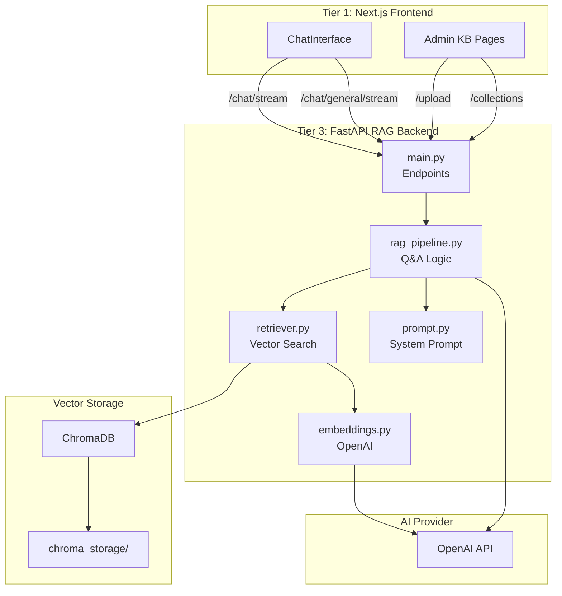
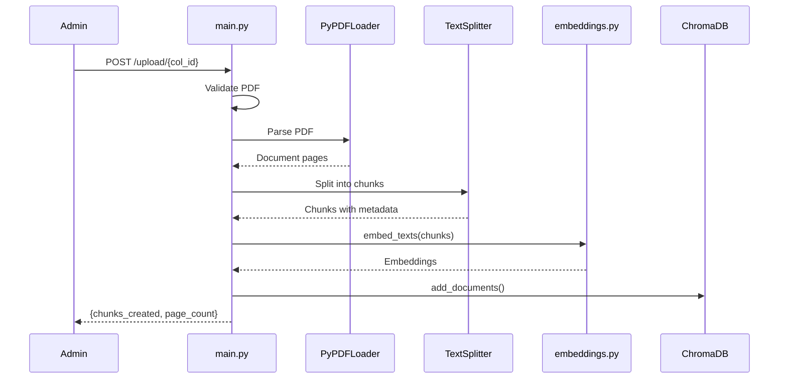
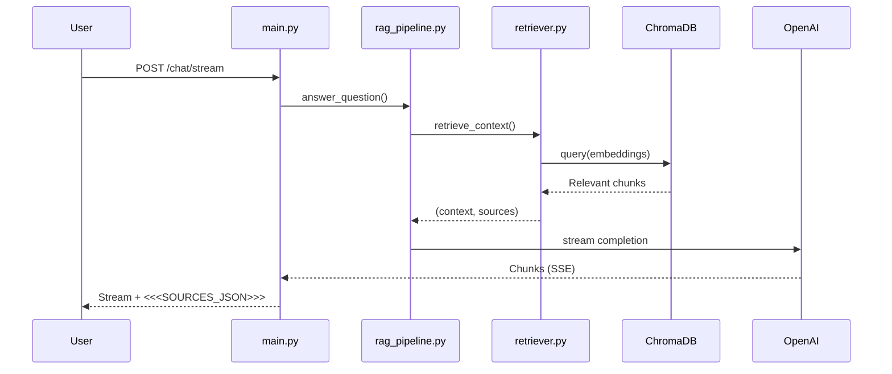

# FastAPI RAG Backend Implementation v1

> Multi-collection RAG system with PDF processing, vector storage, and streaming AI responses.

---

## Version History

| Version | Date | Summary |
|---------|------|---------|
| v1 | 2026-01-14 | Initial documentation - multi-collection RAG, streaming, source metadata |

---

## Architecture Context

### System Position



### Communication Points

| From | To | Purpose |
|------|-----|---------|
| Next.js ChatInterface | `/chat/stream` | RAG queries with streaming |
| Next.js ChatInterface | `/chat/general/stream` | General AI chat (no KB) |
| Next.js Admin Pages | `/upload/{collection_id}` | PDF upload and vectorization |
| Next.js Admin Pages | `/collections/{id}` | Create/delete collections |

---

## Module Structure

### File Overview

| File | Lines | Purpose |
|------|-------|---------|
| [`main.py`](file:///c:/personalData/devProjects/medbax/fast/main.py) | 568 | FastAPI app with all endpoints |
| [`retriever.py`](file:///c:/personalData/devProjects/medbax/fast/retriever.py) | 215 | ChromaDB operations |
| [`rag_pipeline.py`](file:///c:/personalData/devProjects/medbax/fast/rag_pipeline.py) | 78 | RAG Q&A logic |
| [`prompt.py`](file:///c:/personalData/devProjects/medbax/fast/prompt.py) | 40 | System prompt template |
| [`embeddings.py`](file:///c:/personalData/devProjects/medbax/fast/embeddings.py) | 33 | OpenAI embeddings |
| [`config.py`](file:///c:/personalData/devProjects/medbax/fast/config.py) | 19 | Configuration constants |

---

## Configuration (`config.py`)

```python
# ChromaDB Settings
CHROMA_PATH = "./chroma_storage"

# Model Settings
EMBEDDING_MODEL = "text-embedding-3-large"
CHAT_MODEL = "gpt-4o-mini"

# Chunking Settings
CHUNK_SIZE = 1000      # Characters per chunk
CHUNK_OVERLAP = 200    # Overlap between chunks

# API Settings
RAG_API_URL = "http://localhost:8000"
```

---

## Core Modules

### 1. `embeddings.py` - OpenAI Embeddings

Wrapper for OpenAI's embedding API.

```python
def embed_text(text: str) -> list[float]:
    """Generate embedding for a single text string."""

def embed_texts(texts: list[str]) -> list[list[float]]:
    """Generate embeddings for multiple texts (batch)."""
```

Uses `text-embedding-3-large` model for high-quality embeddings.

---

### 2. `retriever.py` - ChromaDB Operations

Manages all ChromaDB interactions.

#### Collection Operations

| Function | Purpose |
|----------|---------|
| `get_collection(id)` | Get or create collection |
| `collection_exists(id)` | Check if collection exists |
| `create_collection(id)` | Create new collection |
| `delete_collection(id)` | Delete collection, returns chunk count |
| `list_collections()` | List all collections with stats |
| `get_collection_stats(id)` | Get chunk/document counts |

#### Document Operations

| Function | Purpose |
|----------|---------|
| `add_documents(id, texts, metadatas, ids)` | Add chunks to collection |
| `delete_document(col_id, doc_id)` | Delete document's chunks |
| `list_documents(col_id)` | List unique documents |

#### Search

```python
def retrieve_context(query: str, collection_id: str, k: int = 5) -> tuple[str, list[dict]]:
    """
    Retrieve relevant context for a query.
    
    Returns:
        - context_text: Formatted context with source citations
        - sources_list: Structured source metadata for frontend
    """
```

**Source Metadata Structure:**
```python
{
    "title": "filename.pdf",
    "snippet": "First 200 chars of chunk...",
    "sourceType": "kb_document",
    "chromaDocumentId": "doc_abc123",
    "pageNumber": 5
}
```

---

### 3. `prompt.py` - System Prompt

**MedBax AI Personality:**
- Warm, conversational, helpful
- Focuses on medical research expertise
- **Citation requirement:** Must cite sources as `[Source: filename.pdf, Page: X]`
- Uses bold formatting, lists, but no headers

```python
SYSTEM_PROMPT = """
You are MedBax AI, a friendly and helpful medical research assistant...
"""

def build_prompt(context: str, question: str) -> str:
    """Build the user prompt with context and question."""
```

---

### 4. `rag_pipeline.py` - RAG Q&A

Core RAG logic with conversation history support.

```python
def answer_question(
    question: str, 
    collection_id: str, 
    stream: bool = True,
    conversation_history: Optional[list] = None
) -> tuple:
    """
    Answer a question using RAG from a specific collection.
    
    Returns:
        Tuple of (response, sources):
        - response: OpenAI response (generator if streaming)
        - sources: List of source metadata dicts
    """
```

**Conversation History:**
- Last 10 messages included for context
- Format: `[{"role": "user/assistant", "content": "..."}]`

---

### 5. `main.py` - FastAPI Endpoints

#### Health & Info

| Endpoint | Method | Response |
|----------|--------|----------|
| `GET /` | GET | `{status, service, version, total_collections}` |

#### Collection Management

| Endpoint | Method | Purpose |
|----------|--------|---------|
| `GET /collections` | GET | List all collections with stats |
| `POST /collections/{collection_id}` | POST | Create new collection |
| `GET /collections/{id}/stats` | GET | Get collection stats |
| `DELETE /collections/{collection_id}` | DELETE | Delete collection |

#### Document Upload

```
POST /upload/{collection_id}?document_id={optional}
Content-Type: multipart/form-data
Body: file (PDF)
```

**Upload Flow:**
1. Validate PDF (content-type, magic bytes)
2. Save to temp file
3. Parse with PyPDFLoader
4. Split into chunks (RecursiveCharacterTextSplitter)
5. Generate embeddings (OpenAI)
6. Store in ChromaDB with metadata

**Chunk Metadata:**
```python
{
    "document_id": "doc_abc123",
    "source": "filename.pdf",
    "page_number": 1,  # 1-indexed
    "chunk_index": 0
}
```

**Response:**
```json
{
    "message": "PDF processed and stored successfully",
    "document_id": "doc_abc123",
    "filename": "document.pdf",
    "chunks_created": 42,
    "page_count": 10
}
```

#### Document Management

| Endpoint | Method | Purpose |
|----------|--------|---------|
| `GET /embeddings/{collection_id}` | GET | List documents in collection |
| `DELETE /embeddings/{col_id}/{doc_id}` | DELETE | Delete document |

#### Chat Endpoints

##### RAG Chat (Streaming)

```
POST /chat/stream
Content-Type: application/json

{
    "query": "What is the immune system?",
    "collection_id": "kb_abc123",
    "include_sources": true,
    "conversation_history": [
        {"role": "user", "content": "..."},
        {"role": "assistant", "content": "..."}
    ]
}
```

**Response:** Plain text stream with source metadata appended:

```
[AI response text...]

<<<SOURCES_JSON>>>
[{"title":"file.pdf","snippet":"...","sourceType":"kb_document","chromaDocumentId":"doc_123","pageNumber":1}]
```

##### General Chat (Streaming, No RAG)

```
POST /chat/general/stream
Content-Type: application/json

{
    "query": "Hello, how are you?",
    "conversation_history": [...]
}
```

**Response:** Plain text stream (no sources).

##### Non-Streaming RAG Chat

```
POST /chat
Content-Type: application/json

{
    "query": "...",
    "collection_id": "..."
}
```

**Response:**
```json
{
    "answer": "...",
    "collection_id": "...",
    "sources": [...]
}
```

---

## Data Flow Diagrams

### PDF Upload Flow



### RAG Query Flow



---

## Error Handling

| HTTP Code | Cause | Example |
|-----------|-------|---------|
| 400 | Invalid request | Bad PDF, empty query |
| 404 | Not found | Collection or document doesn't exist |
| 409 | Conflict | Collection already exists |
| 502 | External API error | OpenAI API failure |

---

## Environment Variables

| Variable | Required | Description |
|----------|----------|-------------|
| `OPENAI_API_KEY` | ✅ | OpenAI API key for embeddings and chat |

Loaded from `fast/.env` file.

---

## Dependencies (`requirements.txt`)

```
# Web Framework
fastapi>=0.109.0
uvicorn[standard]>=0.27.0
python-multipart>=0.0.6

# LangChain Core
langchain>=0.3.0
langchain-community>=0.3.0
langchain-openai>=0.2.0
langchain-chroma>=0.1.0

# Vector Store
chromadb>=0.4.22

# PDF Processing
pypdf>=4.0.0

# Environment
python-dotenv>=1.0.0
```

---

## Running the Server

```bash
# Development
cd fast
pip install -r requirements.txt
uvicorn main:app --reload --port 8000

# Production (example)
uvicorn main:app --host 0.0.0.0 --port 8000 --workers 4
```

---

## Known Issues & TODOs

- [ ] **Hardcoded localhost** - Frontend uses `http://localhost:8000` directly
- [ ] **No authentication** - Endpoints are publicly accessible
- [ ] **CORS wildcard** - Currently allows all origins for debugging
- [ ] **No rate limiting** - Could be abused
- [ ] **Large file handling** - No streaming upload for large PDFs
- [ ] **No retry logic** - OpenAI failures not retried

---

## Related Documentation

- **Knowledge Bases:** [`knowledge_bases_implementation_v1.md`](file:///c:/personalData/devProjects/medbax/implementation/knowledge-bases/knowledge_bases_implementation_v1.md)
- **Chat:** [`chat_implementation_v3.md`](file:///c:/personalData/devProjects/medbax/implementation/chat/chat_implementation_v3.md)
- **Schema:** [`convex/schema.ts`](file:///c:/personalData/devProjects/medbax/convex/schema.ts)
