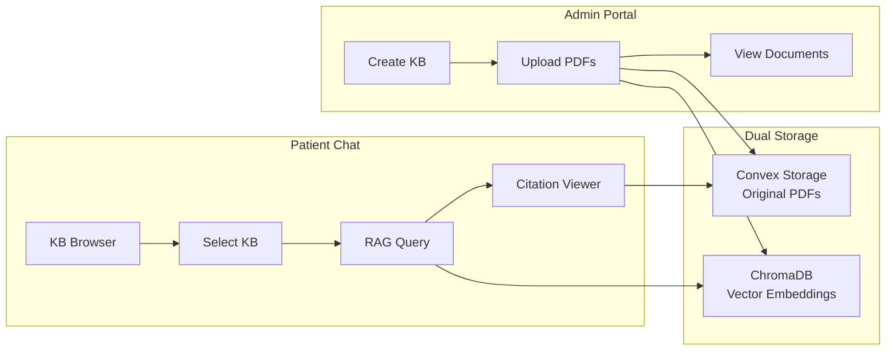

# Knowledge Bases Feature

> Admin-managed RAG collections for medical document retrieval in patient chat.

---

## Overview

Knowledge Bases (KBs) are curated document collections that enable AI-powered Q&A. Admins upload PDFs which are chunked, embedded, and stored in ChromaDB for semantic search. Patients select a KB in chat to query against medical literature.

### Key Relationships

---

## Documentation

| Document | Description |
|----------|-------------|
| [Knowledge Bases Implementation](./knowledge_bases_implementation_v1.md) | Complete technical docs including schema, API surface, data flows |

---

## Quick Reference

### Files Overview

| File | Purpose |
|------|---------|
| `convex/schema.ts` | `knowledgeBases` and `knowledgeBaseDocuments` table definitions |
| `convex/knowledgeBases.ts` | CRUD mutations and queries for KB management |
| `src/app/(dashboard)/admin/knowledge-base/page.tsx` | Admin KB list page with create modal |
| `src/app/(dashboard)/admin/knowledge-base/[id]/page.tsx` | KB detail page with document list and upload |
| `src/components/chat/KnowledgeBaseBrowser.tsx` | Patient-facing KB selector panel |
| `fast/main.py` | FastAPI endpoints for collection/document management |
| `fast/retriever.py` | ChromaDB operations for vector storage |

### Key Operations

| Operation | Admin? | Location |
|-----------|--------|----------|
| Create KB | ✅ | Admin page → `api.knowledgeBases.create` |
| Upload PDF | ✅ | Detail page → Convex Storage + FastAPI `/upload/{collection_id}` |
| Delete KB | ✅ | Admin page → `markDeleting` → FastAPI → `completeDelete` |
| List public KBs | ❌ | Chat → `api.knowledgeBases.listPublic` |
| Query KB (RAG) | ❌ | Chat → FastAPI `/chat/stream` |
