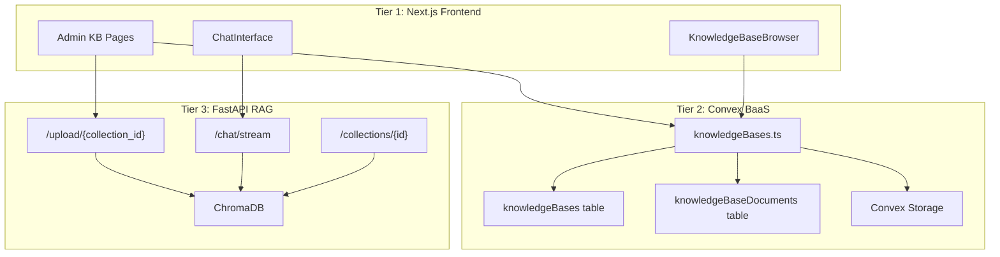
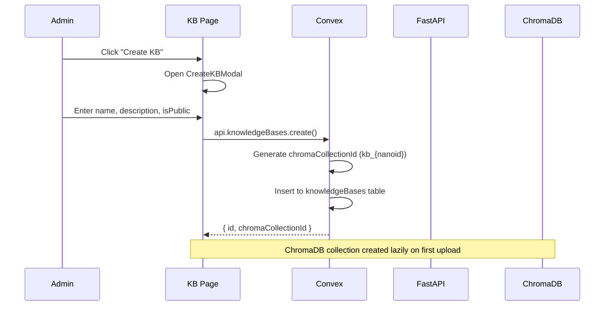
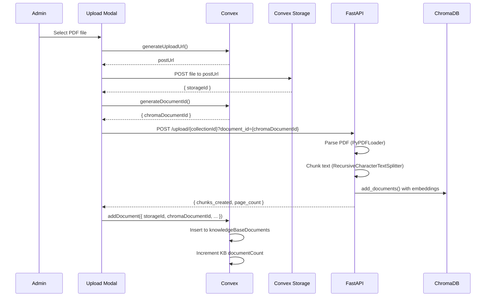
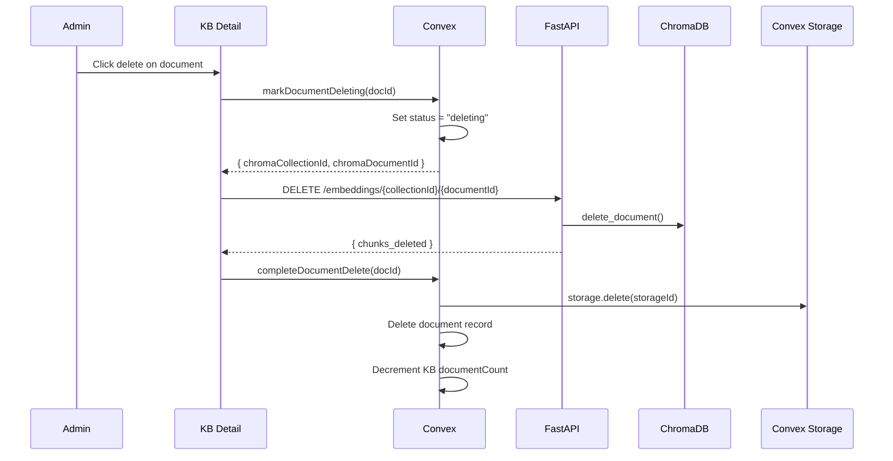
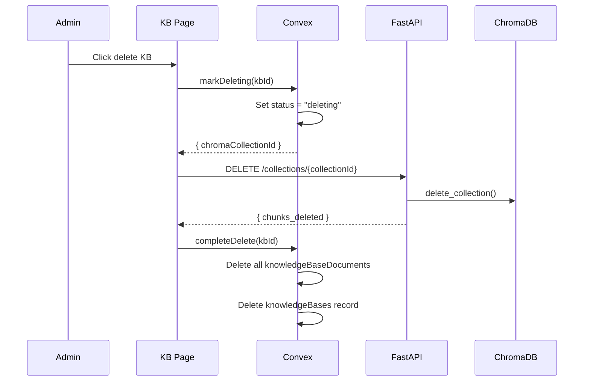
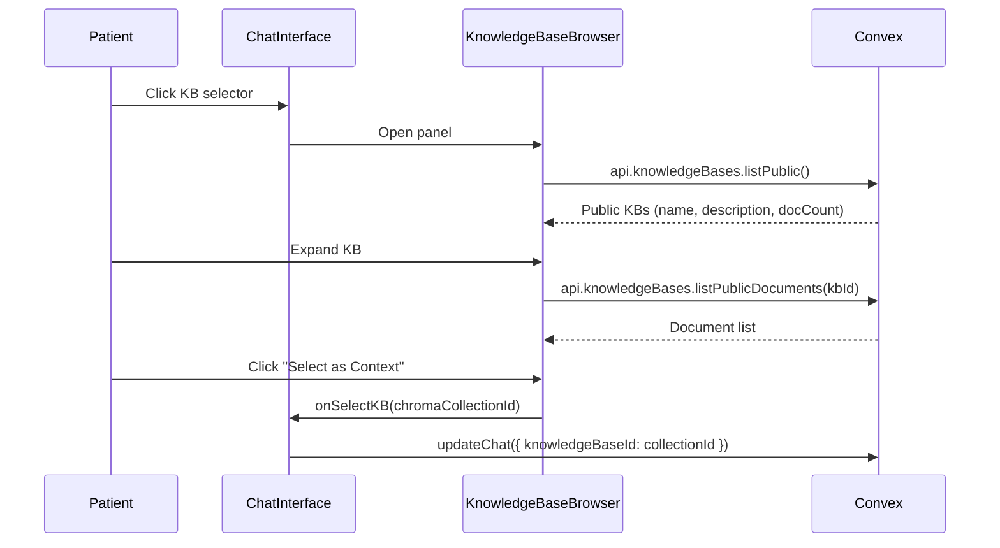
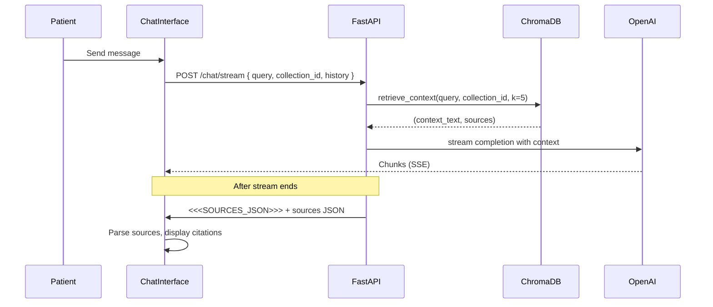

# Knowledge Bases Implementation v1

> Admin-managed RAG collections enabling AI-powered medical document Q&A in patient chat.

---

## Version History

| Version | Date | Summary |
|---------|------|---------|
| v1 | 2025-01-14 | Initial documentation - full KB lifecycle, dual storage, chat integration |

---

## Architecture Context

### System Position



### Communication Points

| Communicates With | Direction | Purpose |
|-------------------|-----------|---------|
| `convex/knowledgeBases.ts` | ↔ bidirectional | KB CRUD, document records, storage URLs |
| FastAPI `/upload/{collection_id}` | → outgoing | PDF vectorization and embedding storage |
| FastAPI `/collections/{id}` | → outgoing | Create/delete collections in ChromaDB |
| FastAPI `/chat/stream` | → outgoing | RAG queries with conversation history |
| Convex Storage | ↔ bidirectional | Original PDF storage for citation viewer |

### Dependencies

- **Upstream:**
  - Clerk authentication (admin role required for KB management)
  - User table (role check via `tokenIdentifier`)

- **Downstream:**
  - ChatInterface (consumes public KBs for context selection)
  - PDFViewer (displays original documents from citations)
  - Messages table (stores sources with `kbDocumentId` references)

---

## Data Model

### `knowledgeBases` Table

```typescript
knowledgeBases: defineTable({
    name: v.string(),                    // e.g., "Cardiology", "Oncology"
    description: v.optional(v.string()), // Brief description for patients
    chromaCollectionId: v.string(),      // Synced ID: "kb_{nanoid}"
    createdBy: v.id("users"),            // Admin who created
    createdAt: v.number(),
    updatedAt: v.number(),
    documentCount: v.number(),           // Cached count
    isPublic: v.boolean(),               // If false, only admins see it
    status: v.union(
      v.literal("active"),
      v.literal("archived"),
      v.literal("deleting")              // Soft-lock during deletion
    ),
})
    .index("by_status", ["status"])
    .index("by_public", ["isPublic", "status"])
    .index("by_chroma_id", ["chromaCollectionId"])
```

### `knowledgeBaseDocuments` Table

```typescript
knowledgeBaseDocuments: defineTable({
    knowledgeBaseId: v.id("knowledgeBases"),
    filename: v.string(),
    chromaDocumentId: v.string(),        // Synced ID: "doc_{nanoid}"
    storageId: v.id("_storage"),         // Link to Convex Storage file
    fileSize: v.number(),
    pageCount: v.optional(v.number()),
    chunkCount: v.number(),
    uploadedBy: v.id("users"),
    uploadedAt: v.number(),
    status: v.union(
      v.literal("processing"),
      v.literal("ready"),
      v.literal("failed"),
      v.literal("deleting")
    ),
    errorMessage: v.optional(v.string()),
})
    .index("by_knowledge_base", ["knowledgeBaseId"])
    .index("by_status", ["knowledgeBaseId", "status"])
    .index("by_chroma_id", ["chromaDocumentId"])
```

### ID Synchronization

The system maintains synced IDs between Convex and ChromaDB:

| Convex Field | Format | Purpose |
|--------------|--------|---------|
| `chromaCollectionId` | `kb_{nanoid}` | Links KB to ChromaDB collection |
| `chromaDocumentId` | `doc_{nanoid}` | Links document to ChromaDB chunks |

Generated in Convex, passed to FastAPI on upload to maintain consistency.

---

## Implementation Details

### Key Files

| File | Lines | Purpose |
|------|-------|---------|
| [`convex/knowledgeBases.ts`](file:///c:/personalData/devProjects/medbax/convex/knowledgeBases.ts) | 525 | All KB mutations and queries |
| [`src/app/(dashboard)/admin/knowledge-base/page.tsx`](file:///c:/personalData/devProjects/medbax/src/app/(dashboard)/admin/knowledge-base/page.tsx) | 360 | KB list with create modal |
| [`src/app/(dashboard)/admin/knowledge-base/[id]/page.tsx`](file:///c:/personalData/devProjects/medbax/src/app/(dashboard)/admin/knowledge-base/[id]/page.tsx) | 550 | Detail page with upload modal |
| [`src/components/chat/KnowledgeBaseBrowser.tsx`](file:///c:/personalData/devProjects/medbax/src/components/chat/KnowledgeBaseBrowser.tsx) | 206 | Patient KB selector in chat |
| [`fast/main.py`](file:///c:/personalData/devProjects/medbax/fast/main.py) | 568 | FastAPI collection/document endpoints |
| [`fast/retriever.py`](file:///c:/personalData/devProjects/medbax/fast/retriever.py) | 215 | ChromaDB operations |

---

## Core Workflows

### 1. Create Knowledge Base



**Key Points:**
- `chromaCollectionId` generated in Convex using `generateId("kb")`
- DB collection created lazily when first document uploaded
- Admin role verified via `tokenIdentifier` lookup

### 2. Upload Document



**Upload Flow Steps:**
1. **Convex Storage** - Original PDF stored for citation viewer
2. **Generate Doc ID** - `doc_{nanoid}` for cross-system linking
3. **FastAPI Processing** - PDF parsed, chunked, embedded
4. **ChromaDB Storage** - Vectors with metadata (source, page_number, document_id)
5. **Convex Record** - Document entry with status=ready

**Chunk Metadata:**
```python
metadatas.append({
    "document_id": doc_id,      # Links all chunks
    "source": file.filename,    # For citation display
    "page_number": page + 1,    # 1-indexed for UI
    "chunk_index": i            # Ordering within doc
})
```

### 3. Delete Document



**Deletion Strategy:**
1. Mark as "deleting" (soft lock prevents concurrent operations)
2. Delete from ChromaDB first (external system)
3. Delete from Convex Storage
4. Delete Convex record and update count

### 4. Delete Knowledge Base



### 5. Patient KB Selection (Chat)



**Selection Persistence:**
- Selected KB stored in `chats.knowledgeBaseId`
- Restored on chat load via `currentChat?.knowledgeBaseId`

### 6. RAG Query with KB



---

## API Surface

### Convex Queries

| Query | Args | Returns | Description |
|-------|------|---------|-------------|
| `list` | - | `KnowledgeBase[]` | All active KBs (admin only) |
| `listPublic` | - | `{_id, name, description, chromaCollectionId, documentCount}[]` | Public KBs for patient selector |
| `get` | `id` | `KnowledgeBase | null` | Single KB by ID |
| `listDocuments` | `knowledgeBaseId` | `KnowledgeBaseDocument[]` | Docs in KB (admin only) |
| `listPublicDocuments` | `knowledgeBaseId` | `{_id, filename, pageCount, uploadedAt}[]` | Docs for patient browser |
| `getDocumentUrl` | `storageId` | `string | null` | Download URL for PDF |
| `getDocumentByFilename` | `knowledgeBaseId, filename` | `KnowledgeBaseDocument | null` | Find doc by name |
| `getDocumentUrlByFilename` | `filename` | `string | null` | PDF URL for citation viewer |
| `getKbDocumentByChromaId` | `chromaDocumentId` | `{url, documentId, filename} | null` | Preferred citation resolution |
| `getKbDocumentUrlById` | `id` | `string | null` | URL by Convex doc ID |

### Convex Mutations

| Mutation | Args | Returns | Description |
|----------|------|---------|-------------|
| `create` | `name, description?, isPublic` | `{id, chromaCollectionId}` | Create KB |
| `update` | `id, name?, description?, isPublic?` | `{success}` | Update KB metadata |
| `archive` | `id` | `{success}` | Soft delete (status=archived) |
| `markDeleting` | `id` | `{chromaCollectionId}` | Lock for deletion |
| `completeDelete` | `id` | `{success, documentsDeleted}` | Finish deletion |
| `generateUploadUrl` | - | `string` | Convex Storage upload URL |
| `generateDocumentId` | - | `{chromaDocumentId}` | Generate doc ID for FastAPI |
| `addDocument` | `knowledgeBaseId, filename, chromaDocumentId, storageId, fileSize, pageCount?, chunkCount` | `{id}` | Record uploaded doc |
| `markDocumentDeleting` | `documentId` | `{chromaCollectionId, chromaDocumentId}` | Lock doc for deletion |
| `completeDocumentDelete` | `documentId` | `{success}` | Finish doc deletion |

### FastAPI Endpoints

| Endpoint | Method | Purpose |
|----------|--------|---------|
| `POST /collections/{collection_id}` | POST | Create ChromaDB collection |
| `GET /collections/{collection_id}/stats` | GET | Collection chunk/doc counts |
| `DELETE /collections/{collection_id}` | DELETE | Delete entire collection |
| `POST /upload/{collection_id}` | POST | Upload and vectorize PDF |
| `GET /embeddings/{collection_id}` | GET | List documents in collection |
| `DELETE /embeddings/{collection_id}/{document_id}` | DELETE | Delete document chunks |
| `POST /chat/stream` | POST | RAG query with streaming |

---

## UI Components

### Admin: Knowledge Base List Page

- Grid of KB cards with name, description, status
- Public/Private badge
- Document count
- Actions: View, Archive, Delete
- "Create Knowledge Base" button → CreateKBModal

### Admin: KB Detail Page

- Header with KB name, visibility badge, description
- Stats: Document count, Total chunks, Collection ID
- Document list with status badges (Ready, Processing, Failed, Deleting)
- File size, page count, chunk count per document
- Upload button → UploadModal
- Delete per document

### Patient: KnowledgeBaseBrowser

- Slide-in panel from chat
- Lists public KBs with descriptions
- Expandable to show documents
- "Select as Context" button per KB
- Check mark on selected KB
- Clear selection option

---

## Configuration

| Setting | Source | Default | Description |
|---------|--------|---------|-------------|
| `NEXT_PUBLIC_RAG_API_URL` | `.env.local` | `http://localhost:8000` | FastAPI backend URL |
| `CHUNK_SIZE` | `fast/config.py` | 1000 | Characters per text chunk |
| `CHUNK_OVERLAP` | `fast/config.py` | 200 | Overlap between chunks |
| `CHROMA_PATH` | `fast/config.py` | `./chroma_db` | ChromaDB persistence path |

---

## Error Handling

### Upload Errors

| Error | Cause | Handling |
|-------|-------|----------|
| Invalid file type | Non-PDF uploaded | Client-side validation, server check |
| PDF parse failure | Corrupt/encrypted PDF | HTTPException 400, error message |
| Embedding failure | OpenAI API error | HTTPException 502 |

### Deletion Errors

- If FastAPI deletion fails, Convex record stays in "deleting" status
- Manual intervention may be needed to clean up orphaned records

---

## Known Issues & TODOs

- [ ] **No retry for failed uploads** - Documents stuck in "processing" with no recovery
- [ ] **No bulk upload** - Single file at a time
- [ ] **Hardcoded localhost** - FastAPI URLs in frontend need environment variable
- [ ] **No document preview** - Can't view PDF before upload
- [ ] **No search within KB** - Admin can't search documents by name
- [ ] **No KB editing** - Can only archive, not edit name/description after creation

---

## Related Documentation

- **Chat:** [implementation/chat/chat_implementation_v1.md](file:///c:/personalData/devProjects/medbax/implementation/chat/chat_implementation_v1.md)
- **Schema:** [convex/schema.ts](file:///c:/personalData/devProjects/medbax/convex/schema.ts)
