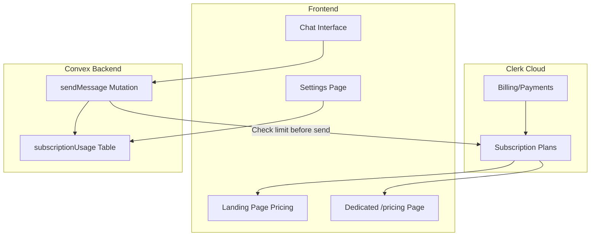
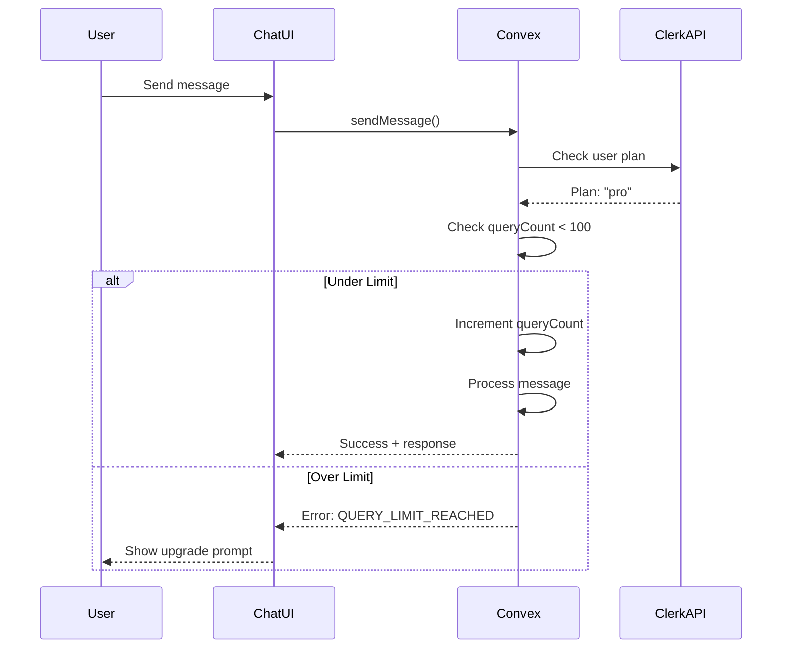

# Subscriptions Implementation v1

> Clerk Billing integration with query-based usage limits (Free: 20, Pro: 100, Premium: 1000).

---

## Version History

| Version | Date | Summary |
|---------|------|---------|
| v1 | 2026-01-06 | Initial implementation - query limits only |

---

## Architecture Context

### System Position



### Communication Points

| Communicates With | Direction | Purpose |
|-------------------|-----------|---------|
| Clerk Dashboard | ← (config) | Plan definitions (free/pro/premium) |
| Clerk Billing API | → (checkout) | Initiate subscription purchase |
| Clerk `has()` | ← (check) | Verify user's current plan |
| Convex subscriptionUsage | ↔ (read/write) | Track monthly query counts |

### Dependencies

- **Upstream:** Clerk Authentication (user identity), Clerk Billing (plan status)
- **Downstream:** Chat system (blocks sending when limit reached)

---

## Subscription Tiers

### Simplified Tier Structure (Testing)

| Tier | Slug | Monthly Price | Query Limit |
|------|------|---------------|-------------|
| Free | `free` | $0 | 20/month |
| Pro | `pro` | $9.99 | 100/month |
| Premium | `premium` | $29.99 | 1,000/month |

> **Note:** Only query limits are enforced. All other features are available to all tiers.

---

## Implementation Details

### Key Files

| File | Purpose | Status |
|------|---------|--------|
| `convex/schema.ts` | subscriptionUsage table (simplified) | ✅ Updated |
| `convex/subscriptionUsage.ts` | Query count tracking | ✅ Updated |
| `src/hooks/useSubscription.ts` | Client-side tier check | ✅ Updated |
| `src/components/landing/pricing-section.tsx` | Landing page pricing | ✅ Updated |
| `src/app/(marketing)/pricing/page.tsx` | Dedicated pricing page | ✅ Updated |
| `src/components/chat/ChatInterface.tsx` | Chat with limit checking | ✅ Updated |
| `src/app/(dashboard)/dashboard/settings/page.tsx` | Settings with usage display | ✅ Updated |

### Core Logic

#### 1. Clerk Dashboard Setup

Create three plans in Clerk Dashboard with slugs:
- `free` (default, no payment required)
- `pro` ($9.99/month)  
- `premium` ($29.99/month)

#### 2. Query Limit Constants

```typescript
// src/lib/subscriptionLimits.ts
export const QUERY_LIMITS = {
    free: 20,
    pro: 100,
    premium: 1000,
} as const;

export type SubscriptionTier = keyof typeof QUERY_LIMITS;
```

#### 3. Check Limit Before Sending Message

```typescript
// In convex/chats.ts sendMessage mutation
const usage = await ctx.db.query("subscriptionUsage")...
const tier = await getUserTier(ctx); // from Clerk
const limit = QUERY_LIMITS[tier];

if (usage.queryCount >= limit) {
    throw new Error("QUERY_LIMIT_REACHED");
}

// Increment count after successful message
await ctx.db.patch(usage._id, { queryCount: usage.queryCount + 1 });
```

### Data Flow



---

## API Surface

### Convex Operations

| Operation | Type | Description |
|-----------|------|-------------|
| `subscriptionUsage.getCurrentUsage` | Query | Get current month's query count |
| `subscriptionUsage.incrementQueryCount` | Mutation | +1 query (called by sendMessage) |
| `subscriptionUsage.canSendQuery` | Query | Pre-check if user can send |

### React Hooks

| Hook | Returns | Purpose |
|------|---------|---------|
| `useSubscription()` | `{ tier, queryLimit, isLoading }` | Get user's current tier |
| `useQueryUsage()` | `{ used, limit, remaining }` | Get current usage stats |

---

## Frontend Integration

### Landing Page Pricing Section

Display three cards with:
- Plan name and price
- Query limit highlighted
- "Get Started" / "Upgrade" CTA
- Link to Clerk checkout for paid plans

### Pricing Page

Same as landing section but standalone page with FAQ.

### Chat Interface

Before sending:
1. Check remaining queries
2. If 0, show upgrade modal instead of sending
3. Display remaining count in UI

---

## Configuration

| Setting | Value | Description |
|---------|-------|-------------|
| `QUERY_LIMITS.free` | 20 | Free tier monthly limit |
| `QUERY_LIMITS.pro` | 100 | Pro tier monthly limit |
| `QUERY_LIMITS.premium` | 1000 | Premium tier monthly limit |

---

## Testing

### Manual Verification

1. Create new user (defaults to free tier)
2. Send 20 messages → should work
3. Send 21st message → should show limit reached
4. Upgrade to Pro via Clerk checkout
5. Send message → should work (limit now 100)

### Test Commands

```bash
# Check current usage in Convex Dashboard
npx convex dashboard
# Navigate to subscriptionUsage table
```

---

## Known Issues & TODOs

- [ ] Implement server-side tier check using Clerk Backend SDK
- [ ] Add billing period reset (monthly)
- [ ] Add usage notification at 80% limit
- [ ] Handle upgrade mid-month (reset or keep count?)
