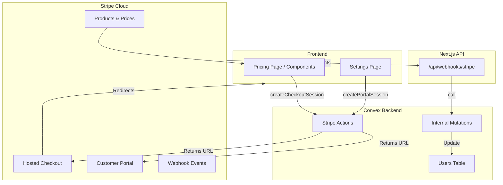

# Subscriptions Implementation v2

> **Migration**: Replacing Clerk Billing with Stripe for complete control over subscription lifecycle and billing portal.

---

## Version History

| Version | Date | Summary |
|---------|------|---------|
| v2 | 2026-01-07 | Migration from Clerk to Stripe. Replaces v1. |
| v1 | 2026-01-06 | Initial implementation - query limits with Clerk |

---

## Architecture Context

### System Position



### Communication Points

| Communicates With | Direction | Purpose |
|-------------------|-----------|---------|
| Stripe API | → (outbound) | Create sessions (Checkout, Portal) |
| Stripe Webhooks | ← (inbound) | Sync subscription status to database |
| Convex `users` | ↔ (read/write) | Store subscriptionId, customerId, status |

---

## Subscription Tiers

| Tier | Price ID (Env) | Monthly Price | Query Limit |
|------|----------------|---------------|-------------|
| Free | N/A | $0 | 20/month |
| Pro | `STRIPE_PRICE_PRO` | $9.99 | 100/month |
| Premium | `STRIPE_PRICE_PREMIUM` | $29.99 | 1,000/month |

---

## Implementation Details

### Key Files

| File | Purpose | Status |
|------|---------|--------|
| `convex/schema.ts` | Add stripe fields to `users` | [PENDING] |
| `convex/stripe.ts` | Actions for Stripe API calls | [NEW] |
| `convex/payments.ts` | Internal mutations from webhooks | [NEW] |
| `src/app/api/webhooks/stripe/route.ts` | Webhook handler | [NEW] |
| `src/lib/stripe.ts` | Stripe client initialization | [NEW] |
| `src/hooks/useSubscription.ts` | Read from `users` table | [MODIFY] |

### Core Logic

#### 1. Database Schema (`users` table updates)

```typescript
// convex/schema.ts
users: defineTable({
  // ... existing fields
  stripeCustomerId: v.optional(v.string()),
  stripeSubscriptionId: v.optional(v.string()),
  stripePriceId: v.optional(v.string()),
  stripeCurrentPeriodEnd: v.optional(v.number()),
  stripeStatus: v.optional(v.string()), // active, past_due, etc
  plan: v.string(), // "free", "pro", "premium"
})
```

#### 2. Checkout Flow

1. User clicks "Upgrade" for Pro.
2. Call `convex/stripe:createCheckoutSession` with `priceId`.
3. Action calls Stripe API → returns URL.
4. Frontend redirects to Stripe.
5. Success → Redirects to `/dashboard/settings?success=true`.
6. Webhook `checkout.session.completed` fires.
7. Webhook handler calls `convex/payments:fulfillCheckout`.
8. `fulfillCheckout` updates `users` table with `customerId` and set `plan="pro"`.

#### 3. Subscription Management

1. User clicks "Manage Subscription" in Settings.
2. Call `convex/stripe:createPortalSession`.
3. Action calls Stripe API → returns URL.
4. Frontend redirects to Portal.
5. User changes plan / cancels.
6. Webhook `customer.subscription.updated` fires.
7. Webhook handler calls `convex/payments:updateSubscription`.
8. `updateSubscription` updates `plan` and `stripePriceId`.

---

## Testing Plan

### Manual Verification

1. **Checkout**: Upgrade from Free to Pro. Verify DB updates.
2. **Portal**: Downgrade or Cancel. Verify DB updates (might happen at period end).
3. **Limits**: Verify `canSendQuery` enforces `QUERY_LIMITS` based on stored `plan`.
4. **Webhooks**: Use `stripe trigger` locally to simulate events.

### Environment Requirements

- `STRIPE_SECRET_KEY`
- `STRIPE_WEBHOOK_SECRET`
- `NEXT_PUBLIC_STRIPE_PUBLISHABLE_KEY`
